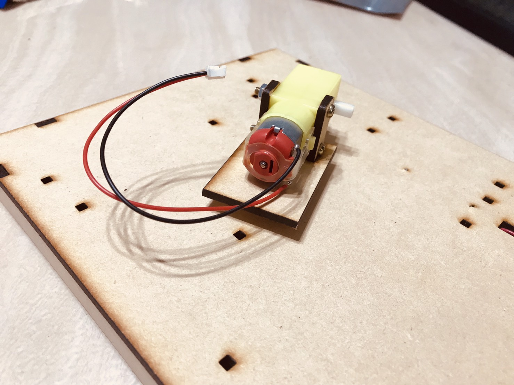

# 一、家庭背景
<h3>

<svg xmlns="http://www.w3.org/2000/svg" width="30" height="30"  fill="currentColor" class="bi bi-house-door" viewBox="0 0 16 16">  <path d="M8.354 1.146a.5.5 0 0 0-.708 0l-6 6A.5.5 0 0 0 1.5 7.5v7a.5.5 0 0 0 .5.5h4.5a.5.5 0 0 0 .5-.5v-4h2v4a.5.5 0 0 0 .5.5H14a.5.5 0 0 0 .5-.5v-7a.5.5 0 0 0-.146-.354L13 5.793V2.5a.5.5 0 0 0-.5-.5h-1a.5.5 0 0 0-.5.5v1.293L8.354 1.146zM2.5 14V7.707l5.5-5.5 5.5 5.5V14H10v-4a.5.5 0 0 0-.5-.5h-3a.5.5 0 0 0-.5.5v4H2.5z"/></svg>  我是<button type="button" style="success">林彥兆</button>，英文名字叫Eric，家中的成員都習慣叫我Eric，來自文化古都『特別甜』的台南，目前就讀台南一中，父母親從小對我非常呵護，但也不致於溺愛；對我期許很高，但也不致於過度期望，總是給我很多的機會和時間可以探索自己的興趣，這樣的教養態度符合父母親的教育志業。

