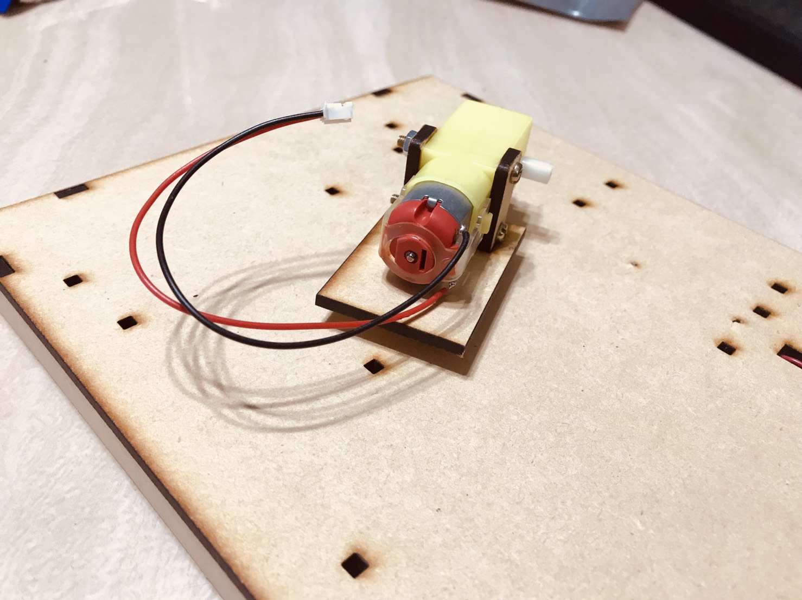

# 二、學習歷程
<h3>

<svg xmlns="http://www.w3.org/2000/svg" width="30" height="30"  fill="currentColor" class="bi bi-house-door" viewBox="0 0 16 16">  <path d="M8.354 1.146a.5.5 0 0 0-.708 0l-6 6A.5.5 0 0 0 1.5 7.5v7a.5.5 0 0 0 .5.5h4.5a.5.5 0 0 0 .5-.5v-4h2v4a.5.5 0 0 0 .5.5H14a.5.5 0 0 0 .5-.5v-7a.5.5 0 0 0-.146-.354L13 5.793V2.5a.5.5 0 0 0-.5-.5h-1a.5.5 0 0 0-.5.5v1.293L8.354 1.146zM2.5 14V7.707l5.5-5.5 5.5 5.5V14H10v-4a.5.5 0 0 0-.5-.5h-3a.5.5 0 0 0-.5.5v4H2.5z"/></svg>  從小我對數學就非常有興趣，國小參加 國中參加 高中參加。
職涯探索時對於工程類的科系興趣較濃，因此高中選修傳統的二類組學程。由於對數學的熱愛，因此對目前較熱門的人工智慧也有一些基本的探索，有時間也會充實程式設計的技能，對垮領域的議題也有一些探索，因此參加一些創客的活動，高中社團也加入機器人研究社。
父母親總是希望我在這些活動中，可以發展出對自我的認知和興趣。

* AI+機器人

* 興趣啟發
* 問題發現
* 專案
* 社會參與
* 競賽

